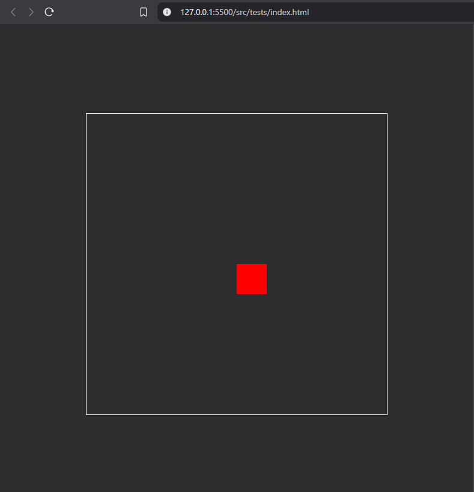

# Game Engine - Web

A game engine written in TypeScript and transpiled to JavaScript.
It includes features that allow you to create games directly from the browser in a simple and easy way, thanks to the flexibility to modify or scale the source code.

## Installation

To use the code directly in the browser via a CDN, paste the following script into your HTML file:

CDN
```js
    <script type="module">
        import { /* import here whatever you need  */ } from "https://cdn.jsdelivr.net/gh/CristianRG/game_engine/src/dist/index.js"
    </script>
```

If you want to use the source code to extend it or develop a game using TypeScript, it is recommended to install the following dependencies to facilitate development (you can configure your environment and decide which tools you do not want to use):

```bash
    "@rollup/plugin-node-resolve": "^16.0.0",
    "@rollup/plugin-typescript": "^12.1.2",
    "@types/node": "^22.13.9",
    "http-server": "^14.1.1",
    "nodemon": "^3.1.9",
    "rollup": "^4.34.9",
    "tslib": "^2.8.1",
    "typescript": "^5.8.2"
```

npm
```bash
npm i @rollup/plugin-node-resolve @rollup/plugin-typescript @types/node http-server nodemon rollup tslib typescript -D
```
pnpm
```bash
pnpm add @rollup/plugin-node-resolve @rollup/plugin-typescript @types/node http-server nodemon rollup tslib typescript -D
```

## Usage

This is a quick guide on how to start the engine, create an entity, and render it on the screen.

In your HTML file:

```html
<!DOCTYPE html>
<html lang="en">
<head>
    <meta charset="UTF-8">
    <meta name="viewport" content="width=device-width, initial-scale=1.0">
    <title>Document</title>
</head>
<body style="display: flex; justify-content: center; align-items: center; height: 100vh; background-color: #2e2d2d;">
    <canvas width="500", height="500" style="border: 1px solid white;"></canvas>
    <script type="module">
        import { Engine, Entity, GlobalState, Transform, Renderable } from "https://cdn.jsdelivr.net/gh/CristianRG/game_engine/src/dist/index.js";
        
        document.addEventListener("DOMContentLoaded", () => {
            const canvas = document.querySelector("canvas");
            const engine = new Engine(canvas);
            engine.start();

            const entity = new Entity();
            entity.addComponent(new Transform(250, 250, 50, 50));
            entity.addComponent(new Renderable("red"));

            const scene = GlobalState.getInstance().scenes[0];
            scene.entities.push(entity);
        });
    </script>
</body>
</html>
```

If everything went well then you should see:



## License

([AGPL-3.0](https://choosealicense.com/licenses/agpl-3.0/))